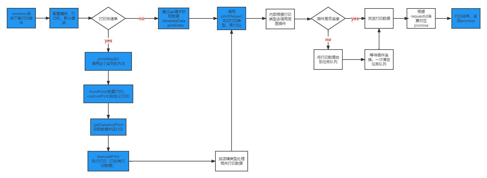

## `大体流程`



## 前置

- 要想做打印需求请先熟悉下面。`不熟悉不要做`
- `windows系统下载菜鸟打印插件(需要重启浏览器)`
- 熟悉菜鸟打印的官方文档(`preview`、`printer`、`documents`)
- 根据上面流程图和下面菜鸟打印封装的文档熟悉内部源码(只用看`printHelper里面关于菜鸟打印的处理`和`rookieAndPddAndDyPrint`这个文件对于菜鸟的 socket 封装)---搞清楚为数不多的`参数的含义`
- 在`打印模版`配置模版信息

## 简介

- [菜鸟打印文档](https://www.cnblogs.com/micro-chen/p/8420944.html)
- `ws封装层没有业务逻辑`
- `全流程支持promise`(ws 层用 Map 实现)
- `不用在外部初始化ws连接`(ws 层用队列实现)
- `printHelper处理快递单数据格式和处理一些通用数据格式`
- 调用 `printHelper.print` 的时候一定要先切换打印类型(`toggleToXXX`),切具体类型由业务决定,`不切换后果自负`
- `printWayBill处理快递单打印逻辑`。不需要在外部做解密快递单数据逻辑
- `一次打印页数可配`

## 自定义 url

### 前提

- `egenie-common版本大于等于0.11.14`

### 抖音自定义模板

- 默认: https://front.ejingling.cn/customer-source/printTemp/dy2.xml
- 可配环境变量: REACT_APP_DY_CUSTOM_TEMPLATE_URL

### 京东自定义模板

- 默认: https://storage.360buyimg.com/jdl-template/custom-1d208dda-02c0-4a31-a3ae-6d88b2f256f3.1624851609527.txt
- 可配环境变量: REACT_APP_JD_CUSTOM_TEMPLATE_URL

### 京东青龙模板

- 默认: http://cloudprint.cainiao.com/template/standard/297499/5
- 可配环境变量: REACT_APP_JDQL_TEMPLATE_URL

### 快手顺丰自定义模板

- 默认: https://front.ejingling.cn/customer-source/printTemp/ks_sf_custom_template.xml
- 可配环境变量: REACT_APP_KS_SF_CUSTOM_TEMPLATE_URL

### 快手其它自定义模板

- 默认: https://front.ejingling.cn/customer-source/printTemp/ks_other_custom_template.xml
- 可配环境变量: REACT_APP_KS_OTHER_CUSTOM_TEMPLATE_URL

### pdd 自定义模板

- courierPrintType 等于 1

  - 默认: https://front.ejingling.cn/customer-source/printTemp/pdd_waybill_yilian_template.xml
  - 可配环境变量: REACT_APP_PDD_TEMPLATE_URL_1

- courierPrintType 等于 0
  - 默认: https://front.ejingling.cn/customer-source/printTemp/pdd_waybill_seller_area_template.xml
  - 可配环境变量: REACT_APP_PDD_TEMPLATE_URL_0

## `获取打印机`

- 返回值: `Promise<string[]>`

```ts
import { printHelper } from 'egenie-common';

printHelper.getPrinters();
```

## `获取自定义打印参数`

- 参数: 模版类型`string`
- 返回值: `Promise<CustomPrintParam>`

```ts
interface CustomPrintParam {
  /**
   * 是否预览
   */
  preview: boolean;

  /**
   * 模版类型
   */
  tempType: string | number;

  /**
   * 模版id
   */
  templateId: number | string;

  /**
   * 打印机
   */
  printer: string;
}
```

> 示例:

```ts
import { getCustomPrintParam } from 'egenie-common';

getCustomPrintParam('27');
```

## `获取打印参数(默认模版)`

- `确保egenie-common版本大于等于0.4.29`
- 参数: 模版类型`string`
- 返回值: `Promise<CustomPrintParam>`

```ts
interface CustomPrintParam {
  /**
   * 是否预览
   */
  preview: boolean;

  /**
   * 模版类型
   */
  tempType: string | number;

  /**
   * 模版id
   */
  templateId: number | string;

  /**
   * 打印机
   */
  printer: string;
}
```

> 示例:

```ts
import { getCustomPrintParamByDefaultTemplate } from 'egenie-common';

getCustomPrintParamByDefaultTemplate('27');
```

## `一般打印-菜鸟打印`

- 参数:

```ts
interface RookiePrintParams {
  /**
   * 一次打印数据页数(默认500)
   */
  count?: number;

  /**
   * 模版数据
   */
  templateData?: TemplateData;

  /**
   * 是否预览
   */
  preview: boolean;

  /**
   * 打印机
   */
  printer?: string;

  /**
   * 打印数据
   */
  contents?: any[];
}
```

- 返回值: `Promise<void>`

```ts
import { printHelper } from 'egenie-common';

const templateData = {};
const printList = [];

printHelper.toggleToRookie();
printHelper.print({
  preview: false,
  templateData: templateData,
  contents: printList,
});
```

## `条码打印`

- 参数: `见一般打印`
- 返回值: `Promise<void>`
- `需要额外处理打印数据`

```ts
import { formatBarcodeData, printHelper } from 'egenie-common';

const templateData = {};
const printList = [];

printHelper.toggleToRookie();
printHelper.print({
  count: 500,
  preview: false,
  templateData: templateData,
  contents: formatBarcodeData(templateData?.rowCount, templateData?.colsCount, printList),
});
```

## `打印快递单`

### 重要参数

- `preview`、`userDataIds`、`tempType`、`printSrc`、`checkPrint`。printSrc、checkPrint 最好和相关人员确定

### `所有参数`

```ts
interface PrintWayBillParams {
  /**
   * 模版类型
   * '0': '快递单',
   * '1': '发货单',
   * '2': '捡货单',
   * '4': '商品信息',
   * '6': '水洗唛',
   * '7': '合格证',
   * '10': '分拣车',
   * '17': '出入库单',
   * '19': '调拨单',
   * '21': '收货单',
   * '27': '唯一码',
   */
  tempType?: string | number;

  /**
   * 是否预览
   */
  preview?: boolean;

  /**
   * 打印机
   */
  printer?: string;

  /**
   * 模版id
   */
  templateId?: number | string;

  /**
   * 待打印发货单ID
   */
  userDataIds?: string;

  /**
   * 打印来源
   *  PRINT_0(0, "未知来源打印"),
   *  PRINT_1(1, "前置打印"),
   *  PRINT_2(2, "分拣打印"),
   *  PRINT_3(3, "分拣补打"),
   *  PRINT_4(4, "收尾打印"),
   *  PRINT_5(5, "波次管理打印"),
   *  PRINT_6(6, "配齐墙单个打印"),
   *  PRINT_7(7, "配齐墙批量打印"),
   *  PRINT_8(8, "打包发货补打打印"),
   *  PRINT_9(9, "PDA分拣配齐后打印"),
   *  PRINT_10(10, "强制拆单打印"),
   *  PRINT_11(11, "分拣打印"),
   *  PRINT_12(12, "多包裹打印"),
   *  PRINT_13(13, "快速分拣打印"),
   *  PRINT_14(14, "快速分拣补打打印"),
   *  PRINT_15(15, "快速分拣配齐墙单个打印"),
   *  PRINT_16(16, "快速分拣配齐墙批量打印"),
   *  PRINT_17(17, "批量分拣打印"),
   *  PRINT_18(18, "确认退货打印"),
   *  PRINT_19(19, "分拣重打");
   */
  printSrc?: string | number;

  /**
   * 排序(暂没有排序策略，不支持，默认可不传)
   */
  orderBy?: string;

  /**
   * 是否校验已打印状态(已打印、在波次内的不能打印)
   */
  checkPrint?: boolean;

  /**
   * 是否更新打印状态(暂时传false状态更新功能另作处理)
   */
  updateStatus?: boolean;

  /**
   * 是否未配齐墙(无用字段)
   */
  sortingWall?: boolean;

  /**
   * 是否清配齐格子(暂不支持传 false)
   */
  clearCell?: boolean;

  /**
   * 快递单号(多包裹获取的新单号)
   */
  courierNo?: string;

  /**
   * 更新回掉的参数
   */
  checkSku?: boolean;
}
```

### `前置打印`

- 参数: `见上`
- 返回值: `Promise<void>`

```ts
import { printWayBill } from 'egenie-common';

printWayBill.frontPrint({
  tempType: 0,
  preview: false,
  userDataIds: '',
});
```

### `自定义打印`

- 参数: `见上`
- 返回值: `Promise<void>`

```ts
import { printWayBill } from 'egenie-common';

printWayBill.customPrint({
  userDataIds: '',
  printSrc: '1',
  checkPrint: true,
});
```

### `获取数据打印`

- 参数: `见上`
- 返回值: `Promise<void>`

```ts
import { printWayBill } from 'egenie-common';

printWayBill.getDataAndPrint({
  printSrc: '19',
  userDataIds: '',
  tempType: 0,
  preview: false,
});
```

### `有数据直接打印`

- 参数:
  - 第一个: `打印参数见上`
  - 第二个: 打印数据`any[]`
- 返回值: `Promise<void>`

```ts
import { printWayBill } from 'egenie-common';

printWayBill.executePrint(
  {
    printSrc: '2',
    userDataIds: '',
    tempType: 0,
    preview: false,
    checkPrint: false,
  },
  [],
);
```

## lodop 打印

- `确保egenie-common版本大于等于0.4.29`
- 此打印比较特殊。不属于上面流程图。简单概括`加载clodop的js文件`--->`获取插件实例`--->`请求数据`--->`根据模版数据调用插件api`--->`返回Promise`
- [官方文档](http://lodop.net/LodopDemo.html)

### 正常打印

```ts
import { printHelper } from 'egenie-common';

const templateData = {};
const printList = [];

printHelper.toggleToLodop();
printHelper.print({
  preview: false,
  templateData: templateData,
  contents: printList,
});
```

### 自定义打印

1. [获取自定义打印参数](#获取自定义打印参数)
2. [正常打印](#正常打印)
