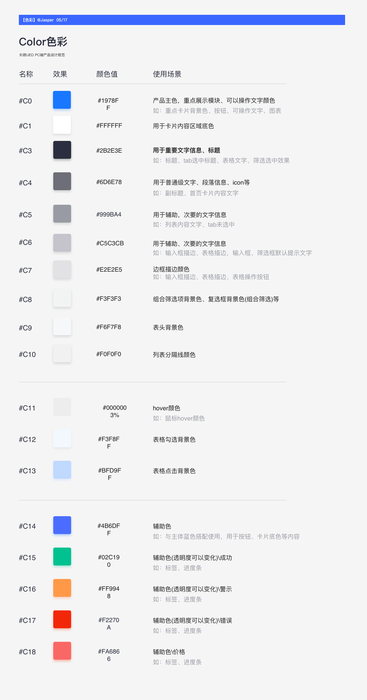

## babel 配置(建立 babel.config.js 文件)

- 对 antd 按需引入

```js
module.exports = require('egenie-babel-config')(true);
```

- 对 antd-mobile 按需引入

```js
module.exports = require('egenie-babel-config')(false);
```

## postcss 配置(建立 postcss.config.js 文件)

- rem 单位。配合 amfe-flexible 更佳
- 不需要 rem 布局填 0

```js
module.exports = require('egenie-config').postcss(0);
```

## [pc 端设计规范](https://lanhuapp.com/web/#/item/project/detailDetach?tid=6e613e3f-e929-4a3e-890c-14c4e7a27812&pid=5a5c091c-28c0-402d-98d7-4c9aec7c93f8&project_id=5a5c091c-28c0-402d-98d7-4c9aec7c93f8&image_id=bef20fda-b22b-492c-83c5-c89b65fba021&fromEditor=true)

- `.egenie-secondary-content`的 css 类为次重要按钮封装样式
- `h1、h2、h3`为主要的标题。默认字体行高都已经设置
- 需要字体设置行高的建议用`Typography.Text`、`Typography.Title`、`Typography.Paragraph`
- `PageHeader`能简单实现页面头部的导航
- `Statistic`简单统计值(能满足需求就可以用)

### `颜色规范`



### `less变量->规范`

```js
// 颜色
const color = {
  // 主色调
  'egenie-primary-color': '#1978ff',

  // 白色
  'egenie-white': '#fff',

  // 标题色
  'egenie-heading-color': '#2b2e3e',

  // 一般文本色
  'egenie-text-color': '#6d6e78',

  // 辅助文本色
  'egenie-text-color-secondary': '#999ba4',

  // 输入框提示文字颜色
  'egenie-input-placeholder-color': '#c5c3cb',

  // 边框颜色
  'egenie-border-color-base': '#e2e2e5',

  // 列表分隔线颜色
  'egenie-border-color-split': '#f0f0f0',

  // 组合筛选框背景颜色
  'egenie-combine-filter-bg': '#f3f3f3',

  // 表头背景
  'egenie-list-heading-bg': '#f6f7f8',

  // 表格悬浮背景
  'egenie-table-row-hover-bg': '#ededed',

  // 表格选中背景
  'egenie-table-selected-row-bg': '#bfd9ff',

  // 表格点击背景
  'egenie-table-click-bg-color': '#bfd9ff',

  // 辅色调
  'egenie-secondary-color': '#4b6dff',

  // 成功颜色
  'egenie-success-color': '#02c190',

  // 警告颜色
  'egenie-warning-color': '#ff9948',

  // 错误颜色
  'egenie-error-color': '#f2270a',

  // 高亮颜色
  'egenie-highlight-color': '#f2270a',

  // 阴影
  'egenie-shadow': '2px 2px 8px 0px #f0f0f0',

  // 禁用背景
  'egenie-disabled-bg': '@egenie-combine-filter-bg',

  // 禁用颜色
  'egenie-disabled-color': '@egenie-input-placeholder-color',

  // 背景颜色
  'egenie-background-bg': '#f2f3f4',

  // 需要强调的卡片模块
  'egenie-highlight-card-bg': 'linear-gradient(331deg, #2d84ff 0%, #396fff 100%)',

  // 重要提示性内容背景底色
  'egenie-important-content-bg': 'rgba(red(@egenie-highlight-color), green(@egenie-highlight-color), blue(@egenie-highlight-color), 0.05)',

  // 标签、次重要按钮
  'egenie-secondary-content-bg': 'rgba(red(@egenie-primary-color), green(@egenie-primary-color), blue(@egenie-primary-color), 0.05)',
};

// 字体-行高
const font = {
  // 基本字体-行高
  'egenie-font-size-sm': '12px',
  'egenie-line-height-sm': '20px',

  // 中型字体-行高
  'egenie-font-size-md': '14px',
  'egenie-line-height-md': '22px',

  // 大字体-行高
  'egenie-font-size-lg': '16px',
  'egenie-line-height-lg': '24px',

  // 更大字体-行高
  'egenie-font-size-xl': '20px',
  'egenie-line-height-xl': '28px',

  // 超大字体-行高
  'egenie-font-size-xxl': '24px',
  'egenie-line-height-xxl': '32px',
};

// 间距-高度
const spacing = {
  // 超大间距
  'egenie-spacing-xxl': '40px',

  // 更大间距
  'egenie-spacing-xl': '32px',

  // 大间距
  'egenie-spacing-lg': '24px',

  // 中到大间距
  'egenie-spacing-mdl': '20px',

  // 中间距
  'egenie-spacing-md': '16px',

  // 小间距
  'egenie-spacing-sm': '12px',

  // 更小间距
  'egenie-spacing-xs': '8px',

  // 超小间距
  'egenie-spacing-xss': '4px',

  // 大高度
  'egenie-height-lg': '40px',

  // 中高度(默认)
  'egenie-height-md': '32px',

  // 小高度
  'egenie-height-sm': '24px',

  // 边框圆角
  'egenie-border-radius-base': '2px',
};
```
